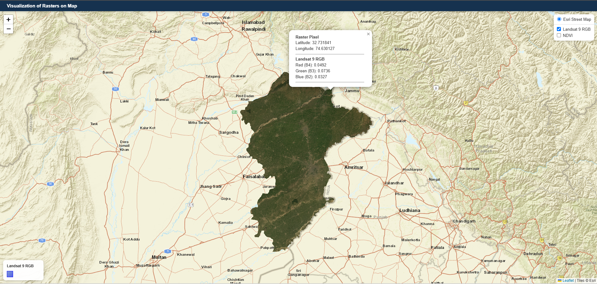
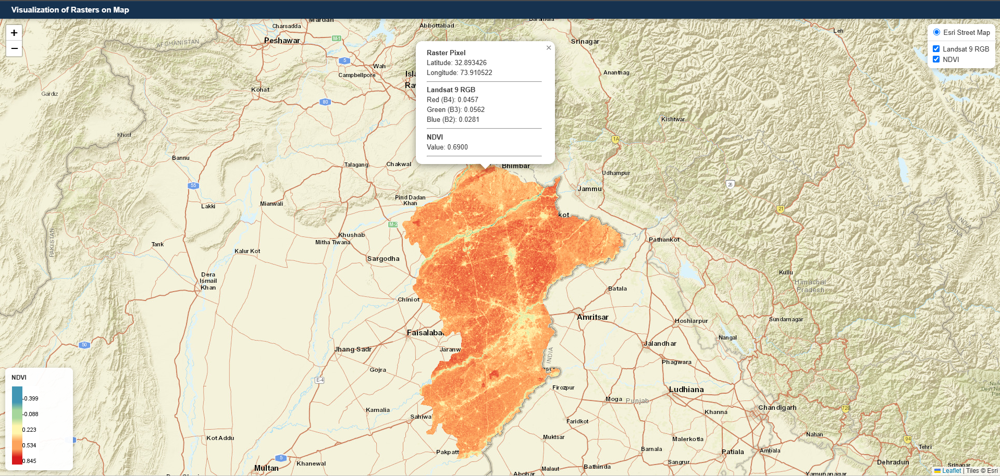

# Landsat 9 Raster WebGIS Viewer

A lightweight Web-GIS application for visualizing and querying large **Landsat 9 remote sensing raster datasets** using **Leaflet.js** and **GeoServer WMS**.

The application displays Landsat 9 **True Color RGB** and **NDVI** raster layers on an interactive web map. Users can switch between raster layers, view their legends, click on the map to retrieve individual raster pixel values, and explore the imagery over an Esri basemap.

---

## Project Overview

This project demonstrates an optimized approach for serving and visualizing **large remote sensing raster datasets in a web browser**.

The source raster datasets are large, reaching **multiple gigabytes (GB)** in size. Instead of sending the complete raster dataset to the browser, the data is processed and prepared for optimized web visualization using **Cloud Optimized GeoTIFF (COG)** and published through **GeoServer WMS**.

The browser therefore requests only the map imagery and raster information required for the current map view rather than downloading the complete source raster.

### Workflow

```text
Landsat 9 Data
      |
      v
Raster Processing
      |
      v
Cloud Optimized GeoTIFF (COG)
      |
      v
GeoServer
      |
      v
WMS
      |
      v
Leaflet.js Web Map
      |
      +----------------------+
      |                      |
      v                      v
RGB Raster              NDVI Raster
      |                      |
      +----------+-----------+
                 |
                 v
         Pixel Identification
                 |
                 v
     GeoServer GetFeatureInfo
                 |
                 v
          Pixel Value Popup
```

---

## Features

- Interactive Leaflet web map
- Esri World Street Map basemap
- Landsat 9 RGB visualization
- Landsat 9 NDVI visualization
- GeoServer WMS integration
- Cloud Optimized GeoTIFF (COG) support
- Raster layer switcher/control
- Automatic raster legend retrieved from GeoServer
- Active-layer legend display
- Click-to-query raster pixel values
- Latitude and longitude display
- RGB pixel value identification
- NDVI pixel value identification
- Pointer cursor when raster layers are active
- Automatic map resizing for responsive layouts
- Automatic zoom-to-raster extent
- Transparent raster overlays
- NoData areas masked from the displayed raster

---

## Screenshots

Screenshots are included to demonstrate the application interface and raster interaction.

> **Privacy / anonymity note:** The screenshots used in this repository should be sanitized before publishing. Remove or blur server IP addresses, internal URLs, usernames, file-system paths, database information, API keys, access tokens, and any other project-specific credentials or infrastructure details.

### 1. RGB Raster View



### 2. NDVI Raster View



---

## Technologies

| Technology | Purpose |
|---|---|
| HTML5 | Web page structure |
| CSS3 | Interface styling and responsive layout |
| JavaScript | Map logic and raster interaction |
| Leaflet.js | Interactive web mapping |
| GeoServer | Raster publishing and WMS services |
| GDAL | Raster processing and COG conversion |
| GeoTIFF | Raster data format |
| Cloud Optimized GeoTIFF (COG) | Optimized raster storage and access |
| Landsat 9 | Remote sensing data source |

---

## Raster Layers

The current application contains two main raster layers.

### 1. Landsat 9 RGB

The RGB layer represents a True Color composite using Landsat 9 bands:

- **Red → Band 4**
- **Green → Band 3**
- **Blue → Band 2**

The resulting three-band raster is prepared for web visualization and published through GeoServer as a WMS layer.

### 2. Landsat 9 NDVI

The NDVI layer represents vegetation conditions calculated from Landsat 9 Near Infrared and Red bands.

```text
NDVI = (NIR - Red) / (NIR + Red)
```

For Landsat 9, the NDVI calculation uses:

```text
NIR = Band 5
Red = Band 4
```

The resulting single-band raster is published through GeoServer and visualized with a raster color style.

---

## Large Raster Optimization

One of the main purposes of this project is to demonstrate how **large GB-scale raster datasets** can be made suitable for interactive web visualization.

A conventional GeoTIFF may contain a large number of pixels and can be expensive to transfer and render directly in a browser.

The application uses the following approach:

```text
Large Source Raster
       |
       v
Raster Preparation / Processing
       |
       v
Cloud Optimized GeoTIFF
       |
       v
GeoServer Raster Layer
       |
       v
WMS Map Requests
       |
       v
Leaflet Browser
```

The browser does **not** need to load the entire multi-GB raster file. GeoServer handles the raster processing and returns the imagery required for the current map view.

This architecture makes the application more practical for large remote sensing datasets while keeping the front-end lightweight.

---

## Cloud Optimized GeoTIFF (COG)

The raster datasets are prepared as **Cloud Optimized GeoTIFFs** using GDAL.

COG preparation can include:

- Internal tiling
- Compression
- Appropriate block sizes
- Internal overviews
- BigTIFF support when required
- Preservation of the raster georeferencing information

A typical GDAL conversion pattern is:

```bash
gdal_translate input.tif output_COG.tif ^
  -of COG ^
  -co COMPRESS=DEFLATE ^
  -co BLOCKSIZE=512 ^
  -co BIGTIFF=IF_SAFER ^
  -co OVERVIEWS=AUTO
```

The exact processing options can be adjusted according to raster size, data type, compression requirements, and the intended GeoServer workflow.

### Why COG?

COG is useful for large raster workflows because the raster is internally organized in a way that supports efficient access to portions of the dataset rather than requiring the entire file to be read for every request.

---

## GeoServer

The processed rasters are published through **GeoServer** as raster coverage layers. Use your own machine-hosted GeoServer for this.

The general structure is:

```text
Workspace
   |
   +-- RGB Raster Coverage
   |
   +-- NDVI Raster Coverage
```

Each raster layer can have its own:

- Coverage/store
- Published layer
- Style
- WMS configuration
- Legend

The browser communicates with GeoServer using **WMS**.

### Example WMS request structure

```text
https://<GEOSERVER_HOST>/geoserver/<WORKSPACE>/wms
```

Use a placeholder such as the above in public documentation rather than publishing private server addresses or internal infrastructure details.

---

## WMS Visualization

Leaflet consumes the GeoServer WMS layers as raster overlays.

Conceptually:

```javascript
L.tileLayer.wms('<GEOSERVER_WMS_URL>', {
    layers: '<WORKSPACE>:<LAYER_NAME>',
    styles: '',
    format: 'image/png',
    transparent: true,
    version: '1.1.1'
});
```

This allows the application to display the raster dynamically as the user pans and zooms the map.

---

## Raster Legends

The application retrieves the legend directly from GeoServer using the WMS `GetLegendGraphic` request.

Conceptually:

```text
GetLegendGraphic
        |
        v
GeoServer
        |
        v
Legend Image
        |
        v
Leaflet Map
```

This keeps the displayed legend synchronized with the active GeoServer raster style.

---

## Pixel Value Identification

A major feature of the application is the ability to click directly on the raster and retrieve the value of the selected pixel.

When the user clicks the map:

```text
User Click
    |
    v
Leaflet Map Coordinates
    |
    v
WMS GetFeatureInfo Request
    |
    v
GeoServer
    |
    v
Raster Pixel Value
    |
    v
Leaflet Popup
```

The application sends a WMS **GetFeatureInfo** request to GeoServer for the active raster layer.

### RGB query

For the RGB raster, the popup reports values corresponding to:

```text
Red   (B4)
Green (B3)
Blue  (B2)
```

### NDVI query

For the NDVI raster, the popup reports the numerical NDVI value of the selected raster location.

The popup also displays:

```text
Latitude
Longitude
Raster values
```

This provides a simple way to inspect the underlying raster data without opening the GeoTIFF in desktop GIS software.

---

## Map Interaction

The application includes several small usability features designed for interactive raster exploration.

### Layer switching

Users can switch between:

- Landsat 9 RGB
- NDVI

The active raster is displayed as a transparent overlay over the Esri street basemap.

### Automatic legend

When the active raster changes, the displayed legend is updated automatically.

### Raster cursor

When one or more raster layers are visible, the map cursor changes to indicate that raster pixel information can be queried.

### Automatic zoom

On application startup, the map automatically zooms to the raster data extent.

### Responsive map

The map automatically invalidates and resizes when the browser window changes size.

---

## Application Architecture

```text
+-----------------------------+
|        Web Browser          |
|                             |
|  HTML / CSS / JavaScript    |
|            |                |
|            v                |
|        Leaflet.js           |
+------------+----------------+
             |
             | WMS
             | GetFeatureInfo
             v
+-----------------------------+
|          GeoServer          |
|                             |
|   RGB Coverage              |
|   NDVI Coverage             |
|   Raster Styles             |
+------------+----------------+
             |
             v
+-----------------------------+
|       COG / GeoTIFF         |
|                             |
|   Large Remote Sensing      |
|   Raster Datasets            |
+-----------------------------+
```

---

## Project Structure

A simple repository structure can be:

```text
landsat9-raster-webgis/
│
├── index.html
├── style.css
├── script.js
├── README.md
│
└── screenshots/
    ├── rgb-viewer.png
    ├── ndvi-viewer.png
```


---

## Configuration

Before running the application, configure the GeoServer WMS endpoint in the JavaScript file.

Example:

```javascript
var geoserverWMS = '<GEOSERVER_WMS_URL>';
```

Then configure the published raster layers:

```javascript
var rgbLayer = L.tileLayer.wms(geoserverWMS, {
    layers: '<WORKSPACE>:<RGB_LAYER>',
    styles: '',
    format: 'image/png',
    transparent: true,
    version: '1.1.1'
});

var ndviLayer = L.tileLayer.wms(geoserverWMS, {
    layers: '<WORKSPACE>:<NDVI_LAYER>',
    styles: '',
    format: 'image/png',
    transparent: true,
    version: '1.1.1'
});
```


---

## Running the Application

The front end is a static HTML/CSS/JavaScript application, but the WMS and GetFeatureInfo requests require the browser to communicate with a reachable GeoServer instance.

A typical development workflow is:

```text
1. Start / make GeoServer available
2. Publish the raster layers
3. Configure the WMS endpoint in the application
4. Open the WebGIS application
5. Select RGB or NDVI
6. Click a raster location
7. Inspect the returned pixel values
```

### Important browser note

For local development, especially when using WMS `GetFeatureInfo`, serving the application through an HTTP server is generally more reliable than opening the HTML file directly with a `file://` URL.

For public hosting, the GeoServer endpoint should be accessible from the web application and configured appropriately for browser requests, including CORS where required.

If the web application is hosted over **HTTPS**, the GeoServer endpoint should also be available over **HTTPS** to avoid browser mixed-content restrictions.

---

## Repository and Data Policy

The repository is intended to contain the **WebGIS application code and documentation** rather than the original multi-GB raster datasets.

The large source rasters and processed COG files are therefore not required to be stored inside the Git repository.

A typical deployment is:

```text
GitHub Repository
        |
        +-- HTML
        +-- CSS
        +-- JavaScript
        +-- Screenshots
        +-- Documentation
        |
        v
Separate GeoServer Infrastructure
        |
        +-- RGB COG
        +-- NDVI COG
```


---

## Performance Considerations

The application is designed around the principle of **server-side raster processing**.

Instead of:

```text
Browser
   |
   +---- Download entire multi-GB TIFF
   |
   +---- Decode entire raster
   |
   +---- Render entire raster
```

the application uses:

```text
Browser
   |
   +---- Request current map imagery
   |
   +---- Request pixel information when clicked
   |
   v
GeoServer
   |
   v
Large COG / Raster Dataset
```

This reduces the amount of raster data that must be transferred to the browser and keeps the front end lightweight.

Actual performance depends on raster size, GeoServer configuration, storage speed, network bandwidth, server resources, WMS settings, compression, overview generation, browser performance, and the number of simultaneous users.

---

## Security and Privacy Notes

This project is intended as a technical WebGIS demonstration.

When publishing the project publicly:

- Do not commit passwords, API keys, database credentials, or access tokens.
- Do not publish private server IPs unless the server is intentionally public.
- Replace infrastructure-specific URLs with placeholders in documentation.
- Remove internal Windows paths and usernames from screenshots.
- Sanitize browser developer-tool screenshots before publishing.
- Check that GeoServer administrative URLs are not unintentionally exposed.
- Use HTTPS for publicly hosted applications and services where appropriate.

The screenshots in this repository are intended to show the application interface and functionality without exposing sensitive deployment details.

---

## Limitations

This implementation is a lightweight demonstration rather than a complete enterprise raster management platform.

The current application focuses on:

- Landsat 9 RGB visualization
- Landsat 9 NDVI visualization
- WMS-based rendering
- Raster legends
- Pixel value identification

Advanced functionality such as raster editing, image classification, temporal analysis, user authentication, multi-user access control, raster analytics, and advanced caching is outside the current scope.

---

## Future Improvements

Possible extensions include:

- Additional Landsat bands and indices
- LST visualization
- More vegetation and water indices
- Time-series imagery
- Date-based raster selection
- Draw and measurement tools
- Coordinate search
- Raster statistics
- Export of queried pixel information
- Profile / transect tools
- User authentication
- GeoWebCache / tile caching
- HTTPS deployment
- Cloud-hosted COG storage
- Additional basemaps
- Mobile-oriented interface improvements

---

## Credits

This project uses the following open-source and public technologies:

- [Leaflet.js](https://leafletjs.com/)
- [GeoServer](https://geoserver.org/)
- [GDAL](https://gdal.org/)
- [GeoTIFF](https://www.ogc.org/standards/geotiff)
- Landsat 9 satellite data
- Esri basemap services

Please review and follow the applicable terms and attribution requirements for the external datasets, map services, and software used in your deployment.

---

## License


```text
MIT License
```


---

## Author

Developed as a **WebGIS / Remote Sensing demonstration project** focused on efficient browser-based visualization and querying of large raster datasets.

